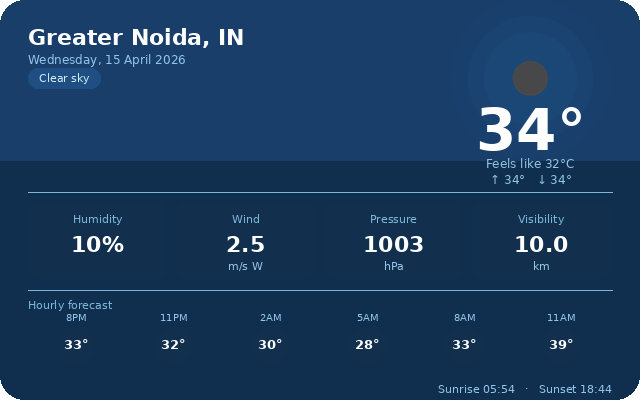

<h1 align="center">Hi, I'm Ritik Ranjan</h1>
<h3 align="center">A passionate Python developer from India</h3>

    

        
    

    

        
    

Building projects, automations, and experiments. This README refreshes itself with live signals.

## Snapshot

- Profile: [https://github.com/rtk-rnjn](https://github.com/rtk-rnjn)
- Last update: 2026-04-15 14:13 UTC
- Moon phase right now: 🌙 (98.30% through the lunar cycle)
- Year progress (2026): 28.66%

`███████░░░░░░░░░░░░░░░░░`

## Weather Feed

Click to expand weather details

- City: Greater Noida
- Condition: Clear sky
- Temperature: 34.1 C

## News Feed

Click to expand news details

## Automation

This README is generated by Python scripts and updated by GitHub Actions every 4 hours.
